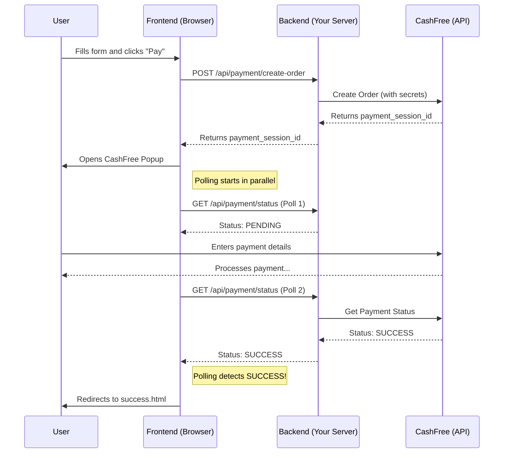

# Everything: A Complete & In-Depth Project Guide

This document provides a comprehensive, A-to-Z guide to the CashFree Payment Integration project. It has been expanded to include deep dives into the code, line-by-line explanations, architectural diagrams, and considerations for production environments.

## Table of Contents
1.  [Project Philosophy & Overview](#1-project-philosophy--overview)
2.  [Core Technologies & Packages](#2-core-technologies--packages)
3.  [Project Setup (In-Depth)](#3-project-setup-in-depth)
    -   [Prerequisites](#prerequisites)
    -   [Installation](#installation)
    -   [Configuration (.env) Explained](#configuration-env-explained)
4.  [Architectural Deep Dive](#4-architectural-deep-dive)
    -   [Project Structure](#project-structure)
    -   [Data Flow & Logic Separation](#data-flow--logic-separation)
5.  [Backend Implementation (Line-by-Line)](#5-backend-implementation-line-by-line)
    -   [The Server (`server.js`)](#the-server-serverjs)
    -   [Payment Routes (`routes/payment.js`)](#payment-routes-routespaymentjs)
    -   [Credit & Data Management (`creditManager.js`)](#credit--data-management-creditmanagerjs)
6.  [Frontend Implementation (Line-by-Line)](#6-frontend-implementation-line-by-line)
    -   [Checkout Page (`public/index.html`)](#checkout-page-publicindexhtml)
    -   [Success & Failure Pages](#success--failure-pages)
7.  [The Payment Flow: Visualized](#7-the-payment-flow-visualized)
    -   [Sequence Diagram](#sequence-diagram)
    -   [Step-by-Step Explanation](#step-by-step-explanation)
8.  [Core Feature: Fast Failed Payment Detection](#8-core-feature-fast-failed-payment-detection)
    -   [The User Experience Problem](#the-user-experience-problem)
    -   [The Hybrid Solution: Polling & Callbacks](#the-hybrid-solution-polling--callbacks)
9.  [API Endpoint Reference](#9-api-endpoint-reference)
10. [Security Best Practices](#10-security-best-practices)
    -   [Critical: Webhook Verification](#critical-webhook-verification)
    -   [Input Validation](#input-validation)
    -   [Secure Error Handling](#secure-error-handling)
11. [Troubleshooting Common Issues](#11-troubleshooting-common-issues)
12. [Deployment & Production Considerations](#12-deployment--production-considerations)

---

## 1. Project Philosophy & Overview

This project is a full-stack web application demonstrating a **robust and resilient** integration of CashFree's payment gateway. The core philosophy is not just to make it work, but to make it **production-ready** by focusing on:

-   **User Experience**: The user should receive clear, instant feedback at every step.
-   **Resilience**: The system should be resilient to network failures and edge cases (e.g., SDK failing to load).
-   **Maintainability**: The code is separated by concerns, making it easy to understand and extend.

Key features include:
-   **Popup Checkout**: A seamless, on-site checkout experience.
-   **Full Payment Cycle**: Gracefully handles payment initiation, success, failure, and cancellation.
-   **Persistent Credit System**: A simple file-based "credit" system to demonstrate post-payment actions.
-   **Instant Failure Detection**: A hybrid polling-and-callback mechanism to detect failed payments in ~3-5 seconds.
-   **Comprehensive Analytics**: Tracks both successful and failed payments.
-   **Dual Environment Support**: Easily switch between `SANDBOX` and `PRODUCTION`.

## 2. Core Technologies & Packages

The project is built with the following technologies. The choice of `axios` over the `cashfree-pg` backend SDK was deliberate to provide more granular control over request timeouts and error handling, which is crucial for the fast-failure detection system.

| Package                             | Version | Purpose & Rationale                                                     |
| ----------------------------------- | ------- | ----------------------------------------------------------------------- |
| `express`                           | `^5.1.0`  | The de-facto standard for building web servers in Node.js.              |
| `@cashfreepayments/cashfree-js`     | `^1.0.5`  | The official CashFree frontend SDK for rendering the checkout popup.    |
| `axios`                             | `^1.10.0` | Promise-based HTTP client. Used for direct backend API calls to CashFree. |
| `cors`                              | `^2.8.5`  | Enables Cross-Origin Resource Sharing, essential for local development. |
| `dotenv`                            | `^17.0.0` | Loads environment variables from a `.env` file for secure configuration. |
| `nodemon`                           | `^3.1.10` | (Dev dependency) Automatically restarts the server on file changes.     |

## 3. Project Setup (In-Depth)

### Prerequisites
-   Node.js (v14 or higher) & npm
-   A CashFree Merchant Account

### Installation
```bash
# 1. Clone the repository
git clone <repository-url>
cd <project-directory>

# 2. Install all dependencies from package.json
npm install
```

### Configuration (.env) Explained
Create a `.env` file in the project root. This file is ignored by Git and is the correct place for all your secrets.

```env
# --- CashFree API Credentials ---
# These are the most sensitive keys. Treat them like passwords.
# Found in your CashFree Merchant Dashboard under Developers -> API Keys.
CASHFREE_APP_ID="YOUR_CASHFREE_APP_ID"
CASHFREE_SECRET_KEY="YOUR_CASHFREE_SECRET_KEY"

# --- Application Configuration ---
# Controls which CashFree environment your backend communicates with.
# Use 'SANDBOX' for all development and testing.
# Only switch to 'PRODUCTION' when you are ready for live payments.
CASHFREE_ENVIRONMENT="SANDBOX" 

# --- Server Configuration ---
# The port your local server will run on.
PORT=3000

# --- Optional: URL Configuration ---
# While optional, explicitly setting these is good practice.
# RETURN_URL is where CashFree might redirect a user in some non-popup flows.
# NOTIFY_URL is the webhook endpoint you configure in the CashFree dashboard.
# RETURN_URL="http://localhost:3000/success"
# NOTIFY_URL="http://localhost:3000/api/payment/webhook" 
```

**To run:**
-   Development: `npm run dev`
-   Production: `npm start`

## 4. Architectural Deep Dive

### Project Structure
```
.
├── data/
│   └── credits.json          # Simple file-based DB for payment records.
├── public/                   # All client-facing static files.
│   ├── home.html             # Landing page.
│   ├── index.html            # The main checkout page SPA (Single Page App).
│   ├── success.html          # Post-payment success page.
│   ├── failure.html          # Post-payment failure/error page.
│   └── cashfree-backup.js    # Local backup of CashFree SDK for resilience.
├── routes/
│   └── payment.js            # Defines all API endpoints related to payments.
├── .env                      # Your local environment configuration.
├── creditManager.js        # Abstraction layer for all data operations.
├── server.js                 # The heart of the backend: Express server setup.
├── package.json              # Project dependencies and scripts.
└── FAILED_PAYMENT_DETECTION.md # Original documentation for the feature.
```

### Data Flow & Logic Separation
The architecture is designed to separate concerns:
1.  **`server.js`**: Handles server initialization and routing only. It doesn't know what a payment is.
2.  **`routes/payment.js`**: The "controller" layer. It handles HTTP requests and responses, calls the CashFree API, and orchestrates actions. It doesn't know how data is stored.
3.  **`creditManager.js`**: The "model" or "data access" layer. Its only job is to read from and write to the `credits.json` file. It knows nothing about HTTP or CashFree.
4.  **`public/`**: The "view" layer. The user interacts with these files, which communicate with the backend via the API defined in `routes/payment.js`.

This separation makes the application easier to debug, maintain, and scale. For example, replacing the JSON file with a real database like PostgreSQL would only require changes in `creditManager.js`.

## 5. Backend Implementation (Line-by-Line)

### The Server (`server.js`)
This file sets up the Express application. The order of middleware and routes is important.

```javascript
// server.js

// 1. Import dependencies
const express = require('express');
const cors = require('cors');
const path = require('path');
require('dotenv').config(); // Loads .env file immediately

const paymentRoutes = require('./routes/payment');

// 2. Initialize Express app
const app = express();
const PORT = process.env.PORT || 3000;

// 3. Global Middleware
app.use(cors()); // Allows frontend (on a different origin) to call the API
app.use(express.json()); // Parses incoming JSON request bodies
app.use(express.urlencoded({ extended: true })); // Parses form data

// 4. API Routes
// All requests to /api/payment/* will be handled by our payment router.
// This must be defined *before* the static middleware.
app.use('/api/payment', paymentRoutes);

// 5. Page Serving Routes
// Explicitly define routes for each HTML page.
app.get('/', (req, res) => res.sendFile(path.join(__dirname, 'public', 'home.html')));
// ... other page routes

// 6. Static File Middleware
// Serves all other files (CSS, images, client-side JS) from the public folder.
app.use(express.static(path.join(__dirname, 'public')));

// 7. Start the server
app.listen(PORT, () => {
    console.log(`Server running on http://localhost:${PORT}`);
});
```

### Payment Routes (`routes/payment.js`)
This is the core of the backend logic.

#### Deep Dive: `POST /create-order`
This endpoint is the first step in any payment.

```javascript
// routes/payment.js

router.post('/create-order', async (req, res) => {
    try {
        // 1. Destructure and validate input from the frontend.
        const { amount, customerName, customerEmail, customerPhone } = req.body;
        if (!amount || !customerName || !customerEmail || !customerPhone) {
            return res.status(400).json({ error: 'Missing required fields' });
        }

        // 2. Prepare the order payload for CashFree.
        const orderId = 'ORDER_' + Date.now(); // Generate a simple unique ID.
        const orderData = {
            order_id: orderId,
            order_amount: parseFloat(amount),
            order_currency: 'INR',
            customer_details: {
                customer_id: 'CUST_' + Date.now(),
                customer_name: customerName,
                customer_email: customerEmail,
                customer_phone: customerPhone,
            },
            order_meta: {
                // The return_url is a fallback. The notify_url is for webhooks.
                return_url: process.env.RETURN_URL || `http://localhost:3000/success?order_id=${orderId}`,
            }
        };

        // 3. Set up the headers for the API call.
        const headers = {
            'Content-Type': 'application/json',
            'x-api-version': '2023-08-01', // Use a recent, stable API version.
            'x-client-id': process.env.CASHFREE_APP_ID,
            'x-client-secret': process.env.CASHFREE_SECRET_KEY,
        };

        // 4. Make the API call using axios.
        const response = await axios.post(
            `${getBaseUrl()}/orders`, // e.g., https://sandbox.cashfree.com/pg/orders
            orderData,
            { headers, timeout: 10000 } // 10-second timeout
        );

        // 5. Send the critical `payment_session_id` back to the frontend.
        res.json({
            success: true,
            order_id: orderId,
            payment_session_id: response.data.payment_session_id,
            environment: process.env.CASHFREE_ENVIRONMENT
        });

    } catch (error) {
        // 6. Robust error handling.
        console.error('❌ Error creating order:', error.response?.data || error.message);
        res.status(500).json({
            success: false,
            error: error.response?.data?.message || 'Failed to create order'
        });
    }
});
```

### Credit & Data Management (`creditManager.js`)
This class handles all file I/O, acting as a mini-database.

#### Deep Dive: `addCredit()` and Idempotency
This method demonstrates a critical concept: **idempotency**. An operation is idempotent if calling it multiple times has the same effect as calling it once. This is vital because both the status polling and the webhook might try to credit the same successful payment.

```javascript
// creditManager.js

addCredit(paymentData) {
    // 1. Read the entire database file.
    const credits = this.readCredits();
    
    // 2. Check if this payment already exists. This is the idempotency check.
    // It prevents us from giving a user credit twice for the same order.
    const existingPayment = credits.payments.find(
        p => p.orderId === paymentData.orderId
    );

    if (existingPayment) {
        console.log('Payment already credited, skipping:', paymentData.orderId);
        return credits.totalCredits; // Return without making changes.
    }

    // 3. If it's a new payment, create the record.
    const newPayment = {
        orderId: paymentData.orderId,
        transactionId: paymentData.transactionId,
        amount: paymentData.amount,
        // ... other details
        timestamp: new Date().toISOString(),
    };

    // 4. Add the new record and update the total.
    credits.payments.push(newPayment);
    credits.totalCredits = credits.payments.length;

    // 5. Write the entire updated database back to the file.
    this.writeCredits(credits);

    console.log(`✅ Credit added! Total credits: ${credits.totalCredits}`);
    return credits.totalCredits;
}
```

## 6. Frontend Implementation (Line-by-Line)

### Checkout Page (`public/index.html`)
This is the most important file on the frontend. It's a mini Single-Page Application.

#### Deep Dive: Resilient SDK Loader
The payment system is useless if the CashFree SDK fails to load. This block of code makes the loading process highly resilient.

```javascript
// public/index.html

// This is an IIFE (Immediately Invoked Function Expression)
// It runs as soon as the script tag is parsed.
(function loadCashFreeSDK() {
    // 1. Define multiple sources for the SDK script.
    const sdkUrls = [
        'https://sdk.cashfree.com/js/v3/cashfree.js',          // Primary CDN
        'https://some-other-cdn.com/cashfree.js',               // A potential secondary CDN
        './cashfree-backup.js'                                // A local file as a last resort
    ];
    
    // 2. The function to attempt loading a single script.
    function tryLoadSDK(url) {
        return new Promise((resolve, reject) => {
            const script = document.createElement('script');
            script.src = url;
            script.async = true;
            // The 'onload' event fires if the script is successfully downloaded and executed.
            script.onload = () => resolve(url);
            // The 'onerror' event fires if the script fails to load (e.g., 404, network error).
            script.onerror = () => reject(new Error('Failed to load from ' + url));
            document.head.appendChild(script);
        });
    }
    
    // 3. An async function to loop through URLs and try them in sequence.
    async function loadWithFallback() {
        for (const url of sdkUrls) {
            try {
                // It will 'await' the result of tryLoadSDK.
                await tryLoadSDK(url);
                // If the await completes without error, the SDK is loaded. We can stop.
                console.log('✅ SDK loaded successfully from:', url);
                return;
            } catch (error) {
                // If it fails, we log a warning and the loop continues to the next URL.
                console.warn(error.message);
            }
        }
        // If the loop finishes without a successful load, all attempts have failed.
        console.error('❌ All SDK loading attempts failed. Checkout is disabled.');
        // Here, we could display a permanent error message to the user.
    }
    
    loadWithFallback();
})();
```

### Success & Failure Pages
-   **`public/success.html`**: The user lands here after a successful payment. It extracts the `order_id` from the URL, calls `/api/payment/status/:orderId` to get the final transaction details, and displays them to the user for confirmation.
-   **`public/failure.html`**: The user lands here after a failed payment. It extracts the `order_id` and error message from the URL and displays them, providing clear reasons for the failure and suggesting next steps (e.g., "Try again" or "Contact support").

## 7. The Payment Flow: Visualized

### Sequence Diagram
This diagram shows the interaction between the different components during a payment.



### Step-by-Step Explanation
1.  **Order Creation**: The flow begins when the user clicks "Pay". The frontend calls the backend, which securely calls CashFree to create an order and gets a `payment_session_id`.
2.  **Checkout & Polling**: The frontend uses the `payment_session_id` to open the CashFree popup. Simultaneously, it starts a polling loop, asking the backend for the payment status every 2 seconds.
3.  **Payment Processing**: The user interacts only with the secure CashFree popup to complete the payment.
4.  **Detection**: The backend's polling request is the first to learn the final status (`SUCCESS` or `FAILED`) from CashFree. It updates its database via `creditManager` and informs the frontend.
5.  **Redirection**: The frontend, upon receiving the final status from the poll, redirects the user to the appropriate page.

## 8. Core Feature: Fast Failed Payment Detection

### The User Experience Problem
Without this feature, if a payment fails, the user is stuck looking at a spinner inside the CashFree popup until CashFree's systems time out (which can take up to a minute). The user doesn't know if they should wait, close the window, or try again. This is a major cause of user frustration and abandoned carts.

### The Hybrid Solution: Polling & Callbacks
This project solves the issue by not waiting for CashFree to tell the browser what happened. It proactively asks.

-   **The Race Condition**: The frontend implements a "race" between two detection methods:
    1.  **Aggressive Polling**: Asks the backend for the status every 2 seconds. This is usually the fastest method for detecting failures.
    2.  **SDK Callbacks**: Listens for the `onSuccess` and `onFailure` events from the CashFree SDK.
-   **First One Wins**: Whichever method gets a definitive status (`SUCCESS` or `FAILED`) first "wins" the race. A flag (`paymentCompleted`) ensures that once a result is processed, all other subsequent triggers are ignored.
-   **Result**: This hybrid approach provides the speed of polling with the reliability of the official callbacks, ensuring failures are detected in **~3-5 seconds**.

## 9. API Endpoint Reference

| Method | Route                             | Description                                            |
| ------ | --------------------------------- | ------------------------------------------------------ |
| `POST` | `/api/payment/create-order`       | Creates a new CashFree payment order.                  |
| `GET`  | `/api/payment/status/:orderId`    | Fetches the current status of an order.                |
| `POST` | `/api/payment/webhook`            | Handles asynchronous payment notifications from CashFree. |
| `GET`  | `/api/payment/credits`            | Retrieves all payment and credit data.                 |
| `GET`  | `/api/payment/failed-payments`    | Retrieves only the log of failed payments.             |
| `POST` | `/api/payment/credits/reset`      | **(Testing Only)** Resets all credit data.             |

## 10. Security Best Practices

### Critical: Webhook Verification
The `routes/payment.js` file includes a `verifySignature` function. **This is currently not used, but it is critical for production security.**

-   **Why?**: Without signature verification, anyone could send a fake request to your webhook URL (`/api/payment/webhook`) and potentially give users credit for payments that never happened.
-   **How it works**: CashFree signs each webhook request with your secret key. The signature is sent in the headers. Your backend must recalculate this signature using the raw request body and the timestamp. If your calculated signature matches the one from CashFree, the webhook is authentic.

### Input Validation
Always validate input on the **backend**, even if you have validation on the frontend. A malicious user can bypass frontend JavaScript and send malformed data to your API. The `create-order` route already performs basic presence checks, which is a good start. For production, you would add more stringent checks (e.g., ensuring `amount` is a valid number).

### Secure Error Handling
The backend should never send detailed database errors or stack traces to the client in a production environment. The current implementation correctly catches errors and sends a generic, user-friendly error message while logging the detailed error on the server for debugging.

## 11. Troubleshooting Common Issues

-   **"CashFree credentials not configured"**: Your `.env` file is missing, not in the root directory, or the `CASHFREE_APP_ID` / `CASHFREE_SECRET_KEY` variables are not set correctly.
-   **Payments work in Sandbox but not Production**: You have likely forgotten to switch `CASHFREE_ENVIRONMENT` to `PRODUCTION` in your `.env` file and update the API keys to your production keys.
-   **401 or 403 Authentication Error from CashFree**: Your API keys are incorrect or you are using sandbox keys for the production environment (or vice-versa).
-   **SDK fails to load**: Check the browser's developer console for network errors. This could be a CDN issue or a local network problem. The fallback loader in this project should mitigate this.
-   **Webhook not working**: Ensure the `NOTIFY_URL` in your `.env` file matches the webhook URL you configured in your CashFree Dashboard. Also, for local testing, your server must be publicly accessible (use a tool like `ngrok`).

## 12. Deployment & Production Considerations

This project is a strong proof-of-concept, but for a real-world production environment, you should make the following changes:

1.  **Use a Real Database**: The `credits.json` file is not suitable for production. It's not scalable, and writing to it on every request can lead to race conditions and data corruption. Replace `creditManager.js` with logic to connect to a proper database like PostgreSQL, MongoDB, or MySQL.
2.  **Secure Your Webhooks**: Implement the webhook signature verification as described in the security section. This is non-negotiable.
3.  **Environment Variables**: On your hosting provider (like Heroku, Vercel, or AWS), set the environment variables (`CASHFREE_APP_ID`, etc.) through the provider's secure configuration interface, not by uploading a `.env` file.
4.  **Disable Reset Route**: The `/api/payment/credits/reset` endpoint is dangerous and should be removed completely or protected behind a strong authentication mechanism in production.
5.  **Error Monitoring**: Integrate an error monitoring service (like Sentry or LogRocket) to be alerted of any backend or frontend errors that occur in production.
