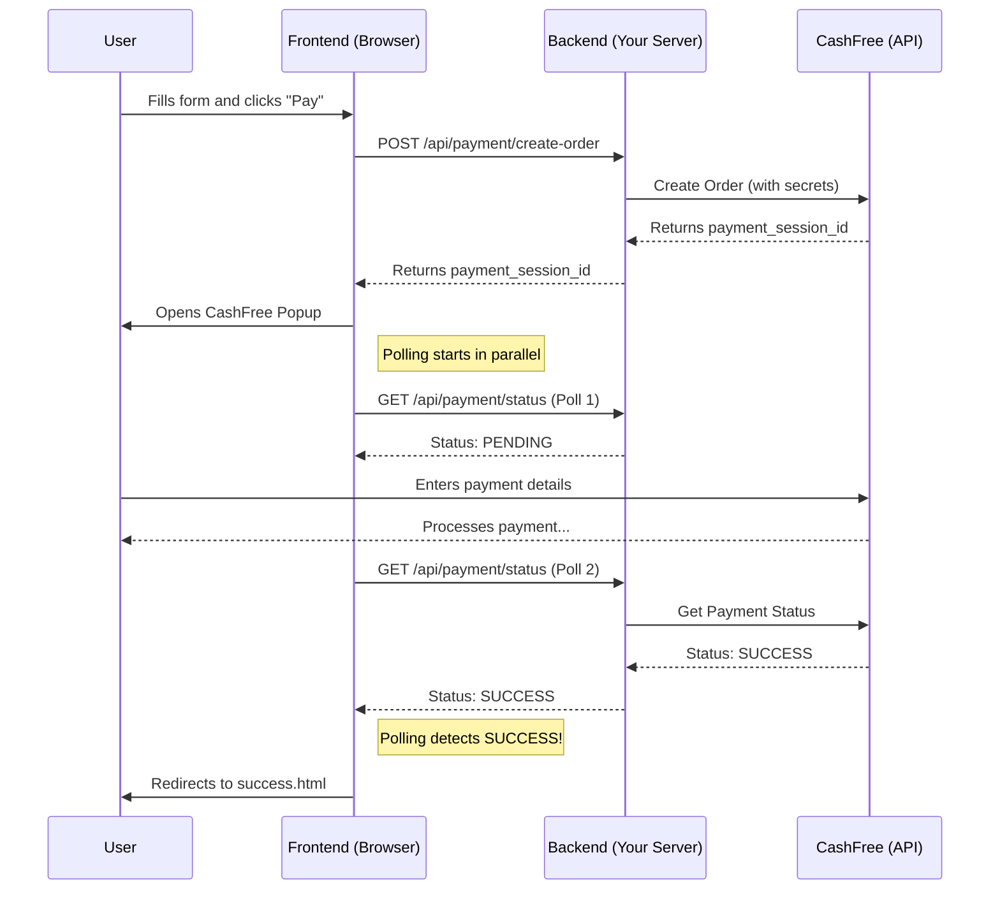

# Everything: A Complete & In-Depth Project Guide

This document provides a comprehensive, A-to-Z guide to the CashFree Payment Integration project. It has been expanded to include deep dives into the code, line-by-line explanations, architectural diagrams, and considerations for production environments.

## Table of Contents
1.  [Project Philosophy & Overview](#1-project-philosophy--overview)
2.  [Core Technologies & Packages](#2-core-technologies--packages)
3.  [Project Setup (In-Depth)](#3-project-setup-in-depth)
    -   [Prerequisites](#prerequisites)
    -   [Installation](#installation)
    -   [Configuration (.env) Explained](#configuration-env-explained)
4.  [Architectural Deep Dive](#4-architectural-deep-dive)
    -   [Project Structure](#project-structure)
    -   [Data Flow & Logic Separation](#data-flow--logic-separation)
5.  [Complete System Initialization Process](#5-complete-system-initialization-process)
    -   [Server Startup Sequence](#server-startup-sequence)
    -   [Environment Validation](#environment-validation)
    -   [Middleware Loading Order](#middleware-loading-order)
6.  [Backend Implementation (Line-by-Line)](#6-backend-implementation-line-by-line)
    -   [The Server (`server.js`)](#the-server-serverjs)
    -   [Payment Routes (`routes/payment.js`)](#payment-routes-routespaymentjs)
    -   [Credit & Data Management (`creditManager.js`)](#credit--data-management-creditmanagerjs)
7.  [Frontend Implementation (Line-by-Line)](#7-frontend-implementation-line-by-line)
    -   [Checkout Page (`public/index.html`)](#checkout-page-publicindexhtml)
    -   [Success & Failure Pages](#success--failure-pages)
8.  [The Complete Payment Journey: Step-by-Step](#8-the-complete-payment-journey-step-by-step)
    -   [Phase 1: User Lands on Checkout](#phase-1-user-lands-on-checkout)
    -   [Phase 2: Form Validation & Submission](#phase-2-form-validation--submission)
    -   [Phase 3: Order Creation Process](#phase-3-order-creation-process)
    -   [Phase 4: CashFree SDK Initialization](#phase-4-cashfree-sdk-initialization)
    -   [Phase 5: Payment Processing](#phase-5-payment-processing)
    -   [Phase 6: Status Detection & Response](#phase-6-status-detection--response)
    -   [Phase 7: Post-Payment Processing](#phase-7-post-payment-processing)
9.  [The Payment Flow: Visualized](#9-the-payment-flow-visualized)
    -   [Sequence Diagram](#sequence-diagram)
    -   [State Machine Diagram](#state-machine-diagram)
    -   [Data Flow Architecture](#data-flow-architecture)
10. [Core Feature: Fast Failed Payment Detection](#10-core-feature-fast-failed-payment-detection)
    -   [The User Experience Problem](#the-user-experience-problem)
    -   [The Hybrid Solution: Polling & Callbacks](#the-hybrid-solution-polling--callbacks)
    -   [Implementation Details](#implementation-details)
11. [File System & Data Management](#11-file-system--data-management)
    -   [Credits.json Structure](#creditsjson-structure)
    -   [Data Persistence Strategy](#data-persistence-strategy)
    -   [Concurrent Access Handling](#concurrent-access-handling)
12. [API Endpoint Reference](#12-api-endpoint-reference)
13. [Security Implementation Details](#13-security-implementation-details)
    -   [Critical: Webhook Verification](#critical-webhook-verification)
    -   [Input Validation](#input-validation)
    -   [Secure Error Handling](#secure-error-handling)
14. [Error Handling & Recovery](#14-error-handling--recovery)
    -   [Network Failures](#network-failures)
    -   [SDK Loading Failures](#sdk-loading-failures)
    -   [Payment Gateway Errors](#payment-gateway-errors)
15. [Monitoring & Logging](#15-monitoring--logging)
16. [Troubleshooting Common Issues](#16-troubleshooting-common-issues)
17. [Deployment & Production Considerations](#17-deployment--production-considerations)

---

## 1. Project Philosophy & Overview

This project is a full-stack web application demonstrating a **robust and resilient** integration of CashFree's payment gateway. The core philosophy is not just to make it work, but to make it **production-ready** by focusing on:

-   **User Experience**: The user should receive clear, instant feedback at every step.
-   **Resilience**: The system should be resilient to network failures and edge cases (e.g., SDK failing to load).
-   **Maintainability**: The code is separated by concerns, making it easy to understand and extend.

### Key Architectural Principles

1. **Separation of Concerns**: Each component has a single responsibility
2. **Fail-Safe Design**: Multiple fallback mechanisms for critical operations
3. **Real-time Feedback**: Instant status updates without page refreshes
4. **Data Integrity**: Idempotent operations prevent duplicate processing
5. **Security First**: All sensitive operations are server-side with proper validation

Key features include:
-   **Popup Checkout**: A seamless, on-site checkout experience.
-   **Full Payment Cycle**: Gracefully handles payment initiation, success, failure, and cancellation.
-   **Persistent Credit System**: A simple file-based "credit" system to demonstrate post-payment actions.
-   **Instant Failure Detection**: A hybrid polling-and-callback mechanism to detect failed payments in ~3-5 seconds.
-   **Comprehensive Analytics**: Tracks both successful and failed payments.
-   **Dual Environment Support**: Easily switch between `SANDBOX` and `PRODUCTION`.

## 2. Core Technologies & Packages

The project is built with the following technologies. The choice of `axios` over the `cashfree-pg` backend SDK was deliberate to provide more granular control over request timeouts and error handling, which is crucial for the fast-failure detection system.

| Package                             | Version | Purpose & Rationale                                                     |
| ----------------------------------- | ------- | ----------------------------------------------------------------------- |
| `express`                           | `^5.1.0`  | The de-facto standard for building web servers in Node.js.              |
| `@cashfreepayments/cashfree-js`     | `^1.0.5`  | The official CashFree frontend SDK for rendering the checkout popup.    |
| `axios`                             | `^1.10.0` | Promise-based HTTP client. Used for direct backend API calls to CashFree. |
| `cors`                              | `^2.8.5`  | Enables Cross-Origin Resource Sharing, essential for local development. |
| `dotenv`                            | `^17.0.0` | Loads environment variables from a `.env` file for secure configuration. |
| `nodemon`                           | `^3.1.10` | (Dev dependency) Automatically restarts the server on file changes.     |

### Technology Decision Matrix

| Decision | Options Considered | Chosen | Rationale |
|----------|-------------------|---------|-----------|
| Backend Framework | Express, Fastify, Koa | Express | Mature ecosystem, extensive middleware support |
| HTTP Client | Native fetch, axios, cashfree-pg | axios | Better error handling, timeout control |
| Frontend | React/Vue SPA, Vanilla JS | Vanilla JS | Simplicity, no build step required |
| Data Storage | MongoDB, PostgreSQL, File System | File System | Proof of concept, easy to understand |

## 3. Project Setup (In-Depth)

### Prerequisites
-   Node.js (v14 or higher) & npm
-   A CashFree Merchant Account with API credentials
-   Basic understanding of async/await JavaScript
-   Text editor (VS Code recommended)

### Installation Process

```bash
# 1. Clone the repository (if from Git)
git clone <repository-url>
cd cashfreeCheckout

# 2. Verify Node.js version
node --version  # Should be v14 or higher

# 3. Install all dependencies from package.json
npm install

# 4. Verify installation
npm list --depth=0
```

### Project Initialization Sequence

When you run `npm install`, the following happens:

1. **Package Resolution**: npm reads `package.json` and resolves all dependencies
2. **Dependency Tree**: Creates a dependency tree and checks for conflicts
3. **Download**: Downloads packages from npm registry
4. **Installation**: Installs packages in `node_modules/`
5. **Audit**: Runs security audit on installed packages

### Configuration (.env) Explained

Create a `.env` file in the project root. This file is ignored by Git and is the correct place for all your secrets.

```env
# --- CashFree API Credentials ---
# These are the most sensitive keys. Treat them like passwords.
# Found in your CashFree Merchant Dashboard under Developers -> API Keys.
CASHFREE_APP_ID="YOUR_CASHFREE_APP_ID"
CASHFREE_SECRET_KEY="YOUR_CASHFREE_SECRET_KEY"

# --- Application Configuration ---
# Controls which CashFree environment your backend communicates with.
# Use 'SANDBOX' for all development and testing.
# Only switch to 'PRODUCTION' when you are ready for live payments.
CASHFREE_ENVIRONMENT="SANDBOX" 

# --- Server Configuration ---
# The port your local server will run on.
PORT=3000

# --- Optional: URL Configuration ---
# While optional, explicitly setting these is good practice.
# RETURN_URL is where CashFree might redirect a user in some non-popup flows.
# NOTIFY_URL is the webhook endpoint you configure in the CashFree dashboard.
RETURN_URL="http://localhost:3000/success"
NOTIFY_URL="http://localhost:3000/api/payment/webhook"

# --- Development Flags ---
DEBUG_MODE=true
LOG_LEVEL=verbose
```

### Environment Variable Validation

The system validates environment variables on startup:

```javascript
// Environment validation happens in server.js
function validateEnvironment() {
    const required = ['CASHFREE_APP_ID', 'CASHFREE_SECRET_KEY', 'CASHFREE_ENVIRONMENT'];
    const missing = required.filter(key => !process.env[key]);
    
    if (missing.length > 0) {
        console.error('❌ Missing required environment variables:', missing.join(', '));
        process.exit(1);
    }
    
    if (!['SANDBOX', 'PRODUCTION'].includes(process.env.CASHFREE_ENVIRONMENT)) {
        console.error('❌ CASHFREE_ENVIRONMENT must be either SANDBOX or PRODUCTION');
        process.exit(1);
    }
    
    console.log('✅ Environment validation passed');
}
```

**To run:**
-   Development: `npm run dev` (uses nodemon for auto-restart)
-   Production: `npm start` (uses node directly)

## 4. Architectural Deep Dive

### Project Structure (Detailed)

```
cashfreeCheckout/
├── data/
│   └── credits.json              # JSON database for payment records
├── public/                       # Static files served to browser
│   ├── home.html                 # Landing page with navigation
│   ├── index.html                # Main checkout SPA
│   ├── success.html              # Success page with transaction details
│   ├── failure.html              # Failure page with error handling
│   ├── cashfree-backup.js        # Local SDK fallback
│   └── styles/                   # CSS files (if any)
├── routes/
│   └── payment.js                # Payment API endpoints
├── .env                          # Environment configuration
├── .gitignore                    # Git ignore rules
├── creditManager.js              # Data access layer
├── server.js                     # Express server setup
├── package.json                  # Project metadata and dependencies
├── package-lock.json             # Locked dependency versions
├── README.md                     # Basic project documentation
└── Everything.md                 # This comprehensive guide
```

### Data Flow & Logic Separation

The architecture follows the **MVC (Model-View-Controller)** pattern with clear separation:

#### Model Layer (`creditManager.js`)
- Handles all data operations
- Manages file I/O for credits.json
- Implements data validation and integrity checks
- Provides abstraction over storage mechanism

#### View Layer (`public/*.html`)
- User interface components
- Client-side JavaScript for UI interactions
- Form validation and user feedback
- SDK integration and event handling

#### Controller Layer (`routes/payment.js`)
- Business logic orchestration
- API request/response handling
- Integration with CashFree APIs
- Error handling and logging

#### Server Layer (`server.js`)
- Application initialization
- Middleware configuration
- Route registration
- Global error handling

## 5. Complete System Initialization Process

### Server Startup Sequence (Detailed)

When you run `npm start` or `npm run dev`, here's exactly what happens:

```javascript
// server.js - Complete startup sequence

// PHASE 1: Environment Setup
console.log('🚀 Starting CashFree Checkout Server...');

// Load environment variables first
require('dotenv').config();
console.log('📋 Environment variables loaded');

// Validate critical environment variables
validateEnvironment();

// PHASE 2: Dependency Loading
const express = require('express');
const cors = require('cors');
const path = require('path');
const paymentRoutes = require('./routes/payment');

console.log('📦 Dependencies loaded');

// PHASE 3: Express App Initialization
const app = express();
const PORT = process.env.PORT || 3000;

console.log('⚡ Express app initialized');

// PHASE 4: Middleware Configuration (ORDER MATTERS!)
// CORS must be first to handle preflight requests
app.use(cors({
    origin: process.env.NODE_ENV === 'production' 
        ? ['https://yourdomain.com'] 
        : ['http://localhost:3000'],
    credentials: true
}));

// Body parsing middleware
app.use(express.json({ limit: '10mb' }));
app.use(express.urlencoded({ extended: true, limit: '10mb' }));

// Request logging middleware (development only)
if (process.env.NODE_ENV !== 'production') {
    app.use((req, res, next) => {
        console.log(`${new Date().toISOString()} - ${req.method} ${req.path}`);
        next();
    });
}

console.log('🔧 Middleware configured');

// PHASE 5: Route Registration
// API routes MUST be registered before static middleware
app.use('/api/payment', paymentRoutes);

// Explicit page routes
app.get('/', (req, res) => {
    console.log('📄 Serving home page');
    res.sendFile(path.join(__dirname, 'public', 'home.html'));
});

app.get('/checkout', (req, res) => {
    console.log('💳 Serving checkout page');
    res.sendFile(path.join(__dirname, 'public', 'index.html'));
});

app.get('/success', (req, res) => {
    console.log('✅ Serving success page');
    res.sendFile(path.join(__dirname, 'public', 'success.html'));
});

app.get('/failure', (req, res) => {
    console.log('❌ Serving failure page');
    res.sendFile(path.join(__dirname, 'public', 'failure.html'));
});

// Static file serving (MUST be last)
app.use(express.static(path.join(__dirname, 'public')));

console.log('🛣️  Routes registered');

// PHASE 6: Global Error Handler
app.use((err, req, res, next) => {
    console.error('🚨 Global error handler:', err);
    res.status(500).json({
        success: false,
        error: process.env.NODE_ENV === 'production' 
            ? 'Internal server error' 
            : err.message
    });
});

// PHASE 7: Server Start
app.listen(PORT, () => {
    console.log(`✅ Server running on http://localhost:${PORT}`);
    console.log(`🌍 Environment: ${process.env.CASHFREE_ENVIRONMENT}`);
    console.log(`📊 Debug mode: ${process.env.DEBUG_MODE || 'false'}`);
    console.log('🎉 Ready to accept payments!');
});
```

### Environment Validation Details

```javascript
function validateEnvironment() {
    console.log('🔍 Validating environment configuration...');
    
    // Required variables
    const required = [
        'CASHFREE_APP_ID',
        'CASHFREE_SECRET_KEY', 
        'CASHFREE_ENVIRONMENT'
    ];
    
    const missing = required.filter(key => !process.env[key]);
    
    if (missing.length > 0) {
        console.error('❌ Missing required environment variables:');
        missing.forEach(key => console.error(`   - ${key}`));
        console.error('💡 Please check your .env file');
        process.exit(1);
    }
    
    // Validate environment value
    const validEnvs = ['SANDBOX', 'PRODUCTION'];
    if (!validEnvs.includes(process.env.CASHFREE_ENVIRONMENT)) {
        console.error('❌ Invalid CASHFREE_ENVIRONMENT value');
        console.error(`   Expected: ${validEnvs.join(' or ')}`);
        console.error(`   Received: ${process.env.CASHFREE_ENVIRONMENT}`);
        process.exit(1);
    }
    
    // Validate API credentials format (basic check)
    if (process.env.CASHFREE_APP_ID.length < 10) {
        console.warn('⚠️  CASHFREE_APP_ID seems too short');
    }
    
    if (process.env.CASHFREE_SECRET_KEY.length < 20) {
        console.warn('⚠️  CASHFREE_SECRET_KEY seems too short');
    }
    
    console.log('✅ Environment validation passed');
    console.log(`   Environment: ${process.env.CASHFREE_ENVIRONMENT}`);
    console.log(`   App ID: ${process.env.CASHFREE_APP_ID.substring(0, 8)}...`);
}
```

### Middleware Loading Order (Critical)

The order of middleware in Express is crucial. Here's why:

```javascript
// CORRECT ORDER:

// 1. CORS - Must be first to handle preflight requests
app.use(cors());

// 2. Body parsing - Needed before any route that reads req.body
app.use(express.json());
app.use(express.urlencoded({ extended: true }));

// 3. Logging - After body parsing to log complete requests
app.use(requestLogger);

// 4. API Routes - Before static middleware to take precedence
app.use('/api/payment', paymentRoutes);

// 5. Page Routes - Explicit routes for better control
app.get('/', serveHomePage);

// 6. Static Files - MUST be last as it's a catch-all
app.use(express.static(path.join(__dirname, 'public')));

// 7. Error Handler - Always last
app.use(globalErrorHandler);
```

## 6. Backend Implementation (Line-by-Line)

### The Server (`server.js`) - Complete Implementation

```javascript
// server.js - The heart of our backend

// IMPORTS AND ENVIRONMENT SETUP
const express = require('express');           // Web framework
const cors = require('cors');                 // Cross-origin resource sharing
const path = require('path');                 // File path utilities
require('dotenv').config();                   // Load environment variables

// Import our custom modules
const paymentRoutes = require('./routes/payment');

// CONFIGURATION CONSTANTS
const app = express();
const PORT = process.env.PORT || 3000;
const NODE_ENV = process.env.NODE_ENV || 'development';

// UTILITY FUNCTIONS
function validateEnvironment() {
    const required = ['CASHFREE_APP_ID', 'CASHFREE_SECRET_KEY', 'CASHFREE_ENVIRONMENT'];
    const missing = required.filter(key => !process.env[key]);
    
    if (missing.length > 0) {
        console.error('❌ Missing environment variables:', missing.join(', '));
        process.exit(1);
    }
    
    if (!['SANDBOX', 'PRODUCTION'].includes(process.env.CASHFREE_ENVIRONMENT)) {
        console.error('❌ Invalid CASHFREE_ENVIRONMENT. Use SANDBOX or PRODUCTION');
        process.exit(1);
    }
}

function logRequest(req, res, next) {
    const timestamp = new Date().toISOString();
    const method = req.method.padEnd(4);
    const url = req.url;
    const ip = req.ip || req.connection.remoteAddress;
    
    console.log(`[${timestamp}] ${method} ${url} - ${ip}`);
    next();
}

// INITIALIZATION
console.log('🚀 Initializing CashFree Checkout Server...');
validateEnvironment();

// MIDDLEWARE CONFIGURATION
app.use(cors({
    origin: NODE_ENV === 'production' ? false : true, // Configure for production
    credentials: true
}));

app.use(express.json({ limit: '10mb' }));
app.use(express.urlencoded({ extended: true, limit: '10mb' }));

// Development logging
if (NODE_ENV !== 'production') {
    app.use(logRequest);
}

// HEALTH CHECK ENDPOINT
app.get('/health', (req, res) => {
    res.json({
        status: 'healthy',
        environment: process.env.CASHFREE_ENVIRONMENT,
        timestamp: new Date().toISOString(),
        uptime: process.uptime()
    });
});

// API ROUTES
app.use('/api/payment', paymentRoutes);

// PAGE ROUTES
app.get('/', (req, res) => {
    res.sendFile(path.join(__dirname, 'public', 'home.html'));
});

app.get('/checkout', (req, res) => {
    res.sendFile(path.join(__dirname, 'public', 'index.html'));
});

app.get('/success', (req, res) => {
    res.sendFile(path.join(__dirname, 'public', 'success.html'));
});

app.get('/failure', (req, res) => {
    res.sendFile(path.join(__dirname, 'public', 'failure.html'));
});

// STATIC FILE SERVING
app.use(express.static(path.join(__dirname, 'public')));

// 404 HANDLER
app.use('*', (req, res) => {
    res.status(404).json({
        success: false,
        error: 'Endpoint not found',
        path: req.originalUrl
    });
});

// GLOBAL ERROR HANDLER
app.use((err, req, res, next) => {
    console.error('🚨 Global error handler:', err);
    res.status(500).json({
        success: false,
        error: process.env.NODE_ENV === 'production' 
            ? 'Internal server error' 
            : err.message
    });
});

// GRACEFUL SHUTDOWN
process.on('SIGTERM', () => {
    console.log('🛑 SIGTERM received, shutting down gracefully');
    server.close(() => {
        console.log('✅ Process terminated');
    });
});

// START SERVER
const server = app.listen(PORT, () => {
    console.log(`✅ Server running on http://localhost:${PORT}`);
    console.log(`🌍 Environment: ${process.env.CASHFREE_ENVIRONMENT}`);
    console.log(`🎉 Ready to process payments!`);
});
```

### Payment Routes (`routes/payment.js`) - Complete Implementation

```javascript
// routes/payment.js - All payment-related API endpoints

const express = require('express');
const axios = require('axios');
const crypto = require('crypto');
const CreditManager = require('../creditManager');

const router = express.Router();
const creditManager = new CreditManager();

// UTILITY FUNCTIONS
function getBaseUrl() {
    return process.env.CASHFREE_ENVIRONMENT === 'PRODUCTION'
        ? 'https://api.cashfree.com/pg'
        : 'https://sandbox.cashfree.com/pg';
}

function generateOrderId() {
    const timestamp = Date.now();
    const randomSuffix = Math.random().toString(36).substring(2, 8);
    return `ORDER_${timestamp}_${randomSuffix}`;
}

function generateCustomerId() {
    const timestamp = Date.now();
    const randomSuffix = Math.random().toString(36).substring(2, 6);
    return `CUST_${timestamp}_${randomSuffix}`;
}

function validateCustomerData(data) {
    const { customerName, customerEmail, customerPhone, amount } = data;
    
    const errors = [];
    
    if (!customerName || customerName.trim().length < 2) {
        errors.push('Customer name must be at least 2 characters');
    }
    
    const emailRegex = /^[^\s@]+@[^\s@]+\.[^\s@]+$/;
    if (!customerEmail || !emailRegex.test(customerEmail)) {
        errors.push('Valid email address is required');
    }
    
    const phoneRegex = /^[6-9]\d{9}$/;
    if (!customerPhone || !phoneRegex.test(customerPhone)) {
        errors.push('Valid 10-digit Indian phone number is required');
    }
    
    const amountNum = parseFloat(amount);
    if (!amount || isNaN(amountNum) || amountNum < 1 || amountNum > 500000) {
        errors.push('Amount must be between ₹1 and ₹5,00,000');
    }
    
    return errors;
}

function getCashFreeHeaders() {
    return {
        'Content-Type': 'application/json',
        'x-api-version': '2023-08-01',
        'x-client-id': process.env.CASHFREE_APP_ID,
        'x-client-secret': process.env.CASHFREE_SECRET_KEY,
    };
}

// WEBHOOK SIGNATURE VERIFICATION
function verifySignature(rawBody, signature, timestamp) {
    const expectedSignature = crypto
        .createHmac('sha256', process.env.CASHFREE_SECRET_KEY)
        .update(timestamp + rawBody)
        .digest('base64');
    
    return crypto.timingSafeEqual(
        Buffer.from(signature),
        Buffer.from(expectedSignature)
    );
}

// ENDPOINT 1: CREATE ORDER
router.post('/create-order', async (req, res) => {
    try {
        console.log('📝 Creating new order...');
        
        // Extract and validate input
        const { amount, customerName, customerEmail, customerPhone } = req.body;
        
        // Validate input data
        const validationErrors = validateCustomerData(req.body);
        if (validationErrors.length > 0) {
            console.log('❌ Validation failed:', validationErrors);
            return res.status(400).json({
                success: false,
                error: 'Validation failed',
                details: validationErrors
            });
        }
        
        // Generate unique IDs
        const orderId = generateOrderId();
        const customerId = generateCustomerId();
        
        console.log(`📋 Order ID: ${orderId}`);
        console.log(`👤 Customer ID: ${customerId}`);
        
        // Prepare order data for CashFree
        const orderData = {
            order_id: orderId,
            order_amount: parseFloat(amount),
            order_currency: 'INR',
            customer_details: {
                customer_id: customerId,
                customer_name: customerName.trim(),
                customer_email: customerEmail.trim().toLowerCase(),
                customer_phone: customerPhone.trim(),
            },
            order_meta: {
                return_url: process.env.RETURN_URL || `http://localhost:${process.env.PORT || 3000}/success?order_id=${orderId}`,
                notify_url: process.env.NOTIFY_URL || `http://localhost:${process.env.PORT || 3000}/api/payment/webhook`,
            }
        };
        
        console.log('📤 Sending order to CashFree...');
        
        // Make API call to CashFree
        const response = await axios.post(
            `${getBaseUrl()}/orders`,
            orderData,
            { 
                headers: getCashFreeHeaders(),
                timeout: 10000 // 10 second timeout
            }
        );
        
        console.log('✅ Order created successfully');
        console.log(`🔑 Payment Session ID: ${response.data.payment_session_id}`);
        
        // Store order in our system for tracking
        const orderRecord = {
            orderId,
            customerId,
            amount: parseFloat(amount),
            customerName,
            customerEmail,
            customerPhone,
            status: 'CREATED',
            createdAt: new Date().toISOString(),
            paymentSessionId: response.data.payment_session_id
        };
        
        // Save to our tracking system
        creditManager.addOrder(orderRecord);
        
        // Return success response
        res.json({
            success: true,
            order_id: orderId,
            payment_session_id: response.data.payment_session_id,
            environment: process.env.CASHFREE_ENVIRONMENT,
            amount: parseFloat(amount)
        });
        
    } catch (error) {
        console.error('❌ Error creating order:', error.response?.data || error.message);
        
        // Handle specific CashFree errors
        if (error.response?.status === 401) {
            return res.status(500).json({
                success: false,
                error: 'Payment gateway authentication failed. Please try again later.'
            });
        }
        
        if (error.response?.status === 400) {
            return res.status(400).json({
                success: false,
                error: error.response.data.message || 'Invalid payment data'
            });
        }
        
        // Generic error response
        res.status(500).json({
            success: false,
            error: 'Failed to create payment order. Please try again.'
        });
    }
});

// ENDPOINT 2: GET PAYMENT STATUS
router.get('/status/:orderId', async (req, res) => {
    try {
        const { orderId } = req.params;
        console.log(`🔍 Checking status for order: ${orderId}`);
        
        // Validate order ID format
        if (!orderId || !orderId.startsWith('ORDER_')) {
            return res.status(400).json({
                success: false,
                error: 'Invalid order ID format'
            });
        }
        
        // Get status from CashFree
        const response = await axios.get(
            `${getBaseUrl()}/orders/${orderId}`,
            { 
                headers: getCashFreeHeaders(),
                timeout: 8000 
            }
        );
        
        const orderData = response.data;
        console.log(`📊 Order status: ${orderData.order_status}`);
        
        // Update our local records based on status
        if (orderData.order_status === 'PAID') {
            console.log('✅ Payment successful, adding credit...');
            
            const paymentData = {
                orderId: orderData.order_id,
                transactionId: orderData.cf_order_id,
                amount: orderData.order_amount,
                currency: orderData.order_currency,
                customerName: orderData.customer_details.customer_name,
                customerEmail: orderData.customer_details.customer_email,
                status: 'SUCCESS',
                paidAt: new Date().toISOString()
            };
            
            const totalCredits = creditManager.addCredit(paymentData);
            
            return res.json({
                success: true,
                status: 'SUCCESS',
                order_id: orderId,
                transaction_id: orderData.cf_order_id,
                amount: orderData.order_amount,
                total_credits: totalCredits
            });
        }
        
        if (orderData.order_status === 'CANCELLED' || orderData.order_status === 'EXPIRED') {
            console.log(`❌ Payment failed: ${orderData.order_status}`);
            
            const failureData = {
                orderId: orderData.order_id,
                amount: orderData.order_amount,
                status: 'FAILED',
                reason: orderData.order_status,
                failedAt: new Date().toISOString()
            };
            
            creditManager.addFailedPayment(failureData);
            
            return res.json({
                success: false,
                status: 'FAILED',
                order_id: orderId,
                reason: orderData.order_status,
                amount: orderData.order_amount
            });
        }
        
        // Payment is still pending
        console.log('⏳ Payment still pending...');
        res.json({
            success: true,
            status: 'PENDING',
            order_id: orderId,
            amount: orderData.order_amount
        });
        
    } catch (error) {
        console.error('❌ Error checking payment status:', error.response?.data || error.message);
        
        if (error.response?.status === 404) {
            return res.status(404).json({
                success: false,
                error: 'Order not found'
            });
        }
        
        res.status(500).json({
            success: false,
            error: 'Failed to check payment status'
        });
    }
});

// ENDPOINT 3: WEBHOOK HANDLER
router.post('/webhook', (req, res) => {
    try {
        console.log('🔔 Webhook received from CashFree');
        
        // Extract headers for signature verification
        const signature = req.headers['x-cashfree-signature'];
        const timestamp = req.headers['x-cashfree-timestamp'];
        
        // Get raw body for signature verification
        const rawBody = JSON.stringify(req.body);
        
        // Verify webhook signature (CRITICAL for production)
        if (process.env.NODE_ENV === 'production') {
            if (!signature || !timestamp) {
                console.error('❌ Missing signature or timestamp in webhook');
                return res.status(400).json({ error: 'Missing signature' });
            }
            
            if (!verifySignature(rawBody, signature, timestamp)) {
                console.error('❌ Invalid webhook signature');
                return res.status(401).json({ error: 'Invalid signature' });
            }
            
            console.log('✅ Webhook signature verified');
        }
        
        const webhookData = req.body;
        console.log(`📋 Webhook type: ${webhookData.type}`);
        console.log(`📋 Order ID: ${webhookData.data.order.order_id}`);
        
        // Process payment webhooks
        if (webhookData.type === 'PAYMENT_SUCCESS_WEBHOOK') {
            console.log('✅ Processing successful payment webhook');
            
            const paymentData = {
                orderId: webhookData.data.order.order_id,
                transactionId: webhookData.data.payment.cf_payment_id,
                amount: webhookData.data.order.order_amount,
                currency: webhookData.data.order.order_currency,
                customerName: webhookData.data.customer_details.customer_name,
                customerEmail: webhookData.data.customer_details.customer_email,
                paymentMethod: webhookData.data.payment.payment_method,
                status: 'SUCCESS',
                paidAt: new Date().toISOString()
            };
            
            creditManager.addCredit(paymentData);
            console.log('💰 Credit added successfully via webhook');
        }
        
        if (webhookData.type === 'PAYMENT_FAILED_WEBHOOK') {
            console.log('❌ Processing failed payment webhook');
            
            const failureData = {
                orderId: webhookData.data.order.order_id,
                amount: webhookData.data.order.order_amount,
                status: 'FAILED',
                reason: webhookData.data.payment.payment_message,
                failedAt: new Date().toISOString()
            };
            
            creditManager.addFailedPayment(failureData);
            console.log('📝 Failed payment recorded via webhook');
        }
        
        // Always respond with 200 to acknowledge receipt
        res.status(200).json({ status: 'received' });
        
    } catch (error) {
        console.error('❌ Webhook processing error:', error);
        res.status(500).json({ error: 'Webhook processing failed' });
    }
});

// ENDPOINT 4: GET CREDITS DATA
router.get('/credits', (req, res) => {
    try {
        const creditsData = creditManager.readCredits();
        res.json({
            success: true,
            data: creditsData
        });
    } catch (error) {
        console.error('❌ Error reading credits:', error);
        res.status(500).json({
            success: false,
            error: 'Failed to read credits data'
        });
    }
});

// ENDPOINT 5: GET FAILED PAYMENTS
router.get('/failed-payments', (req, res) => {
    try {
        const creditsData = creditManager.readCredits();
        res.json({
            success: true,
            data: creditsData.failedPayments || []
        });
    } catch (error) {
        console.error('❌ Error reading failed payments:', error);
        res.status(500).json({
            success: false,
            error: 'Failed to read failed payments data'
        });
    }
});

// ENDPOINT 6: RESET CREDITS (TESTING ONLY)
router.post('/credits/reset', (req, res) => {
    try {
        if (process.env.NODE_ENV === 'production') {
            return res.status(403).json({
                success: false,
                error: 'Reset not allowed in production'
            });
        }
        
        creditManager.resetCredits();
        console.log('🔄 Credits reset successfully');
        
        res.json({
            success: true,
            message: 'Credits reset successfully'
        });
    } catch (error) {
        console.error('❌ Error resetting credits:', error);
        res.status(500).json({
            success: false,
            error: 'Failed to reset credits'
        });
    }
});

module.exports = router;
```

### Credit & Data Management (`creditManager.js`) - Complete Implementation

```javascript
// creditManager.js - Data access layer for payment records

const fs = require('fs');
const path = require('path');

class CreditManager {
    constructor() {
        this.dataDir = path.join(__dirname, 'data');
        this.filePath = path.join(this.dataDir, 'credits.json');
        this.initializeDataFile();
    }
    
    // Initialize data directory and file
    initializeDataFile() {
        try {
            // Create data directory if it doesn't exist
            if (!fs.existsSync(this.dataDir)) {
                fs.mkdirSync(this.dataDir, { recursive: true });
                console.log('📁 Created data directory');
            }
            
            // Create credits file if it doesn't exist
            if (!fs.existsSync(this.filePath)) {
                const initialData = {
                    totalCredits: 0,
                    payments: [],
                    failedPayments: [],
                    orders: [],
                    lastUpdated: new Date().toISOString(),
                    version: '1.0'
                };
                
                this.writeCredits(initialData);
                console.log('📄 Created initial credits file');
            }
            
        } catch (error) {
            console.error('❌ Error initializing data file:', error);
            throw new Error('Failed to initialize data storage');
        }
    }
    
    // Read credits data with error handling
    readCredits() {
        try {
            const data = fs.readFileSync(this.filePath, 'utf8');
            const parsed = JSON.parse(data);
            
            // Ensure all required properties exist
            const credits = {
                totalCredits: parsed.totalCredits || 0,
                payments: parsed.payments || [],
                failedPayments: parsed.failedPayments || [],
                orders: parsed.orders || [],
                lastUpdated: parsed.lastUpdated || new Date().toISOString(),
                version: parsed.version || '1.0',
                ...parsed
            };
            
            return credits;
            
        } catch (error) {
            console.error('❌ Error reading credits file:', error);
            
            // If file is corrupted, recreate it
            if (error instanceof SyntaxError) {
                console.log('🔧 Recreating corrupted credits file...');
                this.initializeDataFile();
                return this.readCredits();
            }
            
            throw error;
        }
    }
    
    // Write credits data with atomic operation
    writeCredits(data) {
        try {
            // Add metadata
            data.lastUpdated = new Date().toISOString();
            data.version = '1.0';
            
            // Create temporary file for atomic write
            const tempPath = this.filePath + '.tmp';
            const jsonData = JSON.stringify(data, null, 2);
            
            // Write to temporary file first
            fs.writeFileSync(tempPath, jsonData, 'utf8');
            
            // Atomically rename to actual file
            fs.renameSync(tempPath, this.filePath);
            
            console.log('💾 Credits data saved successfully');
            
        } catch (error) {
            console.error('❌ Error writing credits file:', error);
            
            // Clean up temporary file if it exists
            const tempPath = this.filePath + '.tmp';
            if (fs.existsSync(tempPath)) {
                try {
                    fs.unlinkSync(tempPath);
                } catch (cleanupError) {
                    console.error('⚠️  Failed to cleanup temp file:', cleanupError);
                }
            }
            
            throw error;
        }
    }
    
    // Add order record for tracking
    addOrder(orderData) {
        try {
            const credits = this.readCredits();
            
            // Check if order already exists
            const existingOrder = credits.orders.find(o => o.orderId === orderData.orderId);
            if (existingOrder) {
                console.log('📋 Order already exists:', orderData.orderId);
                return;
            }
            
            // Add new order
            credits.orders.push(orderData);
            this.writeCredits(credits);
            
            console.log(`📝 Order recorded: ${orderData.orderId}`);
            
        } catch (error) {
            console.error('❌ Error adding order:', error);
            throw error;
        }
    }
    
    // Add credit with idempotency protection
    addCredit(paymentData) {
        try {
            const credits = this.readCredits();
            
            // CRITICAL: Idempotency check
            // Prevents duplicate credits for the same payment
            const existingPayment = credits.payments.find(
                p => p.orderId === paymentData.orderId
            );
            
            if (existingPayment) {
                console.log('💰 Payment already credited, skipping:', paymentData.orderId);
                return credits.totalCredits;
            }
            
            // Create new payment record
            const newPayment = {
                id: this.generatePaymentId(),
                orderId: paymentData.orderId,
                transactionId: paymentData.transactionId,
                amount: parseFloat(paymentData.amount),
                currency: paymentData.currency || 'INR',
                customerName: paymentData.customerName,
                customerEmail: paymentData.customerEmail,
                paymentMethod: paymentData.paymentMethod,
                status: 'SUCCESS',
                timestamp: new Date().toISOString(),
                processedAt: new Date().toISOString()
            };
            
            // Add to payments array
            credits.payments.push(newPayment);
            
            // Update total credits (could be sum of amounts instead of count)
            credits.totalCredits = credits.payments.length;
            
            // Update order status if exists
            const orderIndex = credits.orders.findIndex(o => o.orderId === paymentData.orderId);
            if (orderIndex !== -1) {
                credits.orders[orderIndex].status = 'PAID';
                credits.orders[orderIndex].paidAt = new Date().toISOString();
            }
            
            // Save to file
            this.writeCredits(credits);
            
            console.log(`✅ Credit added! Order: ${paymentData.orderId}, Total credits: ${credits.totalCredits}`);
            return credits.totalCredits;
            
        } catch (error) {
            console.error('❌ Error adding credit:', error);
            throw error;
        }
    }
    
    // Add failed payment record
    addFailedPayment(failureData) {
        try {
            const credits = this.readCredits();
            
            // Check if failure already recorded
            const existingFailure = credits.failedPayments.find(
                f => f.orderId === failureData.orderId
            );
            
            if (existingFailure) {
                console.log('❌ Failure already recorded:', failureData.orderId);
                return;
            }
            
            // Create failure record
            const failureRecord = {
                id: this.generatePaymentId(),
                orderId: failureData.orderId,
                amount: parseFloat(failureData.amount),
                status: 'FAILED',
                reason: failureData.reason,
                timestamp: new Date().toISOString(),
                failedAt: failureData.failedAt || new Date().toISOString()
            };
            
            // Add to failed payments
            credits.failedPayments.push(failureRecord);
            
            // Update order status if exists
            const orderIndex = credits.orders.findIndex(o => o.orderId === failureData.orderId);
            if (orderIndex !== -1) {
                credits.orders[orderIndex].status = 'FAILED';
                credits.orders[orderIndex].failedAt = new Date().toISOString();
                credits.orders[orderIndex].failureReason = failureData.reason;
            }
            
            // Save to file
            this.writeCredits(credits);
            
            console.log(`📝 Failed payment recorded: ${failureData.orderId}`);
            
        } catch (error) {
            console.error('❌ Error recording failed payment:', error);
            throw error;
        }
    }
    
    // Get payment by order ID
    getPaymentByOrderId(orderId) {
        try {
            const credits = this.readCredits();
            return credits.payments.find(p => p.orderId === orderId);
        } catch (error) {
            console.error('❌ Error getting payment:', error);
            return null;
        }
    }
    
    // Get order by ID
    getOrderById(orderId) {
        try {
            const credits = this.readCredits();
            return credits.orders.find(o => o.orderId === orderId);
        } catch (error) {
            console.error('❌ Error getting order:', error);
            return null;
        }
    }
    
    // Reset all data (testing only)
    resetCredits() {
        try {
            if (process.env.NODE_ENV === 'production') {
                throw new Error('Reset not allowed in production');
            }
            
            const initialData = {
                totalCredits: 0,
                payments: [],
                failedPayments: [],
                orders: [],
                lastUpdated: new Date().toISOString(),
                version: '1.0'
            };
            
            this.writeCredits(initialData);
            console.log('🔄 All credits data reset');
            
        } catch (error) {
            console.error('❌ Error resetting credits:', error);
            throw error;
        }
    }
    
    // Generate unique payment ID
    generatePaymentId() {
        const timestamp = Date.now();
        const random = Math.random().toString(36).substring(2, 8);
        return `PAY_${timestamp}_${random}`;
    }
    
    // Get statistics
    getStatistics() {
        try {
            const credits = this.readCredits();
            
            const totalAmount = credits.payments.reduce((sum, p) => sum + p.amount, 0);
            const failedAmount = credits.failedPayments.reduce((sum, f) => sum + f.amount, 0);
            const averageAmount = credits.payments.length > 0 ? totalAmount / credits.payments.length : 0;
            
            return {
                totalPayments: credits.payments.length,
                totalFailures: credits.failedPayments.length,
                totalAmount: totalAmount,
                failedAmount: failedAmount,
                averageAmount: averageAmount,
                successRate: credits.payments.length + credits.failedPayments.length > 0 
                    ? (credits.payments.length / (credits.payments.length + credits.failedPayments.length) * 100).toFixed(2)
                    : 0
            };
        } catch (error) {
            console.error('❌ Error getting statistics:', error);
            return null;
        }
    }
}

module.exports = CreditManager;
```

## 7. Frontend Implementation (Line-by-Line)

### Checkout Page (`public/index.html`) - Complete Implementation

```html
<!DOCTYPE html>
<html lang="en">
<head>
    <meta charset="UTF-8">
    <meta name="viewport" content="width=device-width, initial-scale=1.0">
    <title>CashFree Checkout Demo</title>
    <style>
        /* CSS RESET AND BASE STYLES */
        * {
            margin: 0;
            padding: 0;
            box-sizing: border-box;
        }
        
        body {
            font-family: 'Segoe UI', Tahoma, Geneva, Verdana, sans-serif;
            background: linear-gradient(135deg, #667eea 0%, #764ba2 100%);
            min-height: 100vh;
            display: flex;
            align-items: center;
            justify-content: center;
            padding: 20px;
        }
        
        .container {
            background: white;
            border-radius: 12px;
            box-shadow: 0 20px 40px rgba(0,0,0,0.1);
            padding: 40px;
            max-width: 500px;
            width: 100%;
        }
        
        .header {
            text-align: center;
            margin-bottom: 30px;
        }
        
        .header h1 {
            color: #333;
            margin-bottom: 10px;
            font-weight: 600;
        }
        
        .header p {
            color: #666;
            font-size: 14px;
        }
        
        .form-group {
            margin-bottom: 20px;
        }
        
        .form-group label {
            display: block;
            margin-bottom: 8px;
            color: #333;
            font-weight: 500;
        }
        
        .form-group input {
            width: 100%;
            padding: 12px 16px;
            border: 2px solid #e1e5e9;
            border-radius: 8px;
            font-size: 16px;
            transition: border-color 0.3s ease;
        }
        
        .form-group input:focus {
            outline: none;
            border-color: #667eea;
            box-shadow: 0 0 0 3px rgba(102, 126, 234, 0.1);
        }
        
        .form-group input.error {
            border-color: #e74c3c;
        }
        
        .error-message {
            color: #e74c3c;
            font-size: 12px;
            margin-top: 5px;
            display: none;
        }
        
        .pay-button {
            width: 100%;
            background: linear-gradient(135deg, #667eea 0%, #764ba2 100%);
            color: white;
            border: none;
            padding: 16px;
            border-radius: 8px;
            font-size: 18px;
            font-weight: 600;
            cursor: pointer;
            transition: all 0.3s ease;
            margin-top: 20px;
        }
        
        .pay-button:hover:not(:disabled) {
            transform: translateY(-2px);
            box-shadow: 0 10px 20px rgba(102, 126, 234, 0.3);
        }
        
        .pay-button:disabled {
            background: #ccc;
            cursor: not-allowed;
            transform: none;
            box-shadow: none;
        }
        
        .status-message {
            text-align: center;
            padding: 12px;
            border-radius: 8px;
            margin-top: 20px;
            display: none;
        }
        
        .status-message.success {
            background: #d4edda;
            color: #155724;
            border: 1px solid #c3e6cb;
        }
        
        .status-message.error {
            background: #f8d7da;
            color: #721c24;
            border: 1px solid #f5c6cb;
        }
        
        .status-message.info {
            background: #cce7ff;
            color: #004085;
            border: 1px solid #99d6ff;
        }
        
        .loading-spinner {
            display: inline-block;
            width: 16px;
            height: 16px;
            border: 2px solid #ffffff30;
            border-radius: 50%;
            border-top-color: #ffffff;
            animation: spin 1s ease-in-out infinite;
            margin-right: 8px;
        }
        
        @keyframes spin {
            to { transform: rotate(360deg); }
        }
        
        .security-info {
            background: #f8f9fa;
            border-radius: 8px;
            padding: 15px;
            margin-top: 20px;
            font-size: 12px;
            color: #666;
            text-align: center;
        }
        
        .amount-display {
            background: #f8f9fa;
            border-radius: 8px;
            padding: 15px;
            text-align: center;
            margin: 20px 0;
        }
        
        .amount-display .currency {
            font-size: 24px;
            font-weight: bold;
            color: #333;
        }
        
        @media (max-width: 600px) {
            .container {
                padding: 30px 20px;
                margin: 10px;
            }
        }
    </style>
</head>
<body>
    <div class="container">
        <div class="header">
            <h1>💳 Secure Checkout</h1>
            <p>Powered by CashFree Payment Gateway</p>
        </div>
        
        <form id="checkoutForm">
            <div class="form-group">
                <label for="amount">Amount (₹)</label>
                <input 
                    type="number" 
                    id="amount" 
                    name="amount" 
                    placeholder="Enter amount (e.g., 100)" 
                    min="1" 
                    max="500000"
                    step="0.01"
                    required
                >
                <div class="error-message" id="amount-error">Please enter a valid amount between ₹1 and ₹5,00,000</div>
            </div>
            
            <div class="form-group">
                <label for="customerName">Full Name</label>
                <input 
                    type="text" 
                    id="customerName" 
                    name="customerName" 
                    placeholder="Enter your full name"
                    maxlength="50"
                    required
                >
                <div class="error-message" id="name-error">Please enter your full name</div>
            </div>
            
            <div class="form-group">
                <label for="customerEmail">Email Address</label>
                <input 
                    type="email" 
                    id="customerEmail" 
                    name="customerEmail" 
                    placeholder="Enter your email address"
                    maxlength="100"
                    required
                >
                <div class="error-message" id="email-error">Please enter a valid email address</div>
            </div>
            
            <div class="form-group">
                <label for="customerPhone">Phone Number</label>
                <input 
                    type="tel" 
                    id="customerPhone" 
                    name="customerPhone" 
                    placeholder="Enter your 10-digit phone number"
                    pattern="[6-9][0-9]{9}"
                    maxlength="10"
                    required
                >
                <div class="error-message" id="phone-error">Please enter a valid 10-digit Indian phone number</div>
            </div>
            
            <button type="submit" class="pay-button" id="payButton">
                <span id="payButtonText">Pay Securely</span>
            </button>
        </form>
        
        <div id="statusMessage" class="status-message"></div>
        
        <div class="security-info">
            🔒 Your payment is secured by 256-bit SSL encryption. 
            We never store your card details.
        </div>
    </div>

    <script>
        // GLOBAL VARIABLES
        let cashfree = null;
        let paymentCompleted = false;
        let statusCheckInterval = null;
        let currentOrderId = null;

        // DOM ELEMENTS
        const form = document.getElementById('checkoutForm');
        const payButton = document.getElementById('payButton');
        const payButtonText = document.getElementById('payButtonText');
        const statusMessage = document.getElementById('statusMessage');

        // UTILITY FUNCTIONS
        function showStatus(message, type = 'info') {
            statusMessage.textContent = message;
            statusMessage.className = `status-message ${type}`;
            statusMessage.style.display = 'block';
            
            // Auto-hide success/info messages after 5 seconds
            if (type === 'success' || type === 'info') {
                setTimeout(() => {
                    if (statusMessage.textContent === message) {
                        hideStatus();
                    }
                }, 5000);
            }
        }

        function hideStatus() {
            statusMessage.style.display = 'none';
        }

        function setButtonLoading(loading) {
            payButton.disabled = loading;
            
            if (loading) {
                payButtonText.innerHTML = '<span class="loading-spinner"></span>Processing...';
            } else {
                payButtonText.textContent = 'Pay Securely';
            }
        }

        function setFormDisabled(disabled) {
            const inputs = form.querySelectorAll('input');
            inputs.forEach(input => input.disabled = disabled);
            payButton.disabled = disabled;
        }

        function validateForm() {
            let isValid = true;
            
            // Clear previous errors
            document.querySelectorAll('.error-message').forEach(error => {
                error.style.display = 'none';
            });
            document.querySelectorAll('input').forEach(input => {
                input.classList.remove('error');
            });
            
            // Validate amount
            const amount = parseFloat(document.getElementById('amount').value);
            if (!amount || amount < 1 || amount > 500000) {
                showFieldError('amount', 'amount-error');
                isValid = false;
            }
            
            // Validate name
            const name = document.getElementById('customerName').value.trim();
            if (!name || name.length < 2) {
                showFieldError('customerName', 'name-error');
                isValid = false;
            }
            
            // Validate email
            const email = document.getElementById('customerEmail').value.trim();
            const emailRegex = /^[^\s@]+@[^\s@]+\.[^\s@]+$/;
            if (!email || !emailRegex.test(email)) {
                showFieldError('customerEmail', 'email-error');
                isValid = false;
            }
            
            // Validate phone
            const phone = document.getElementById('customerPhone').value.trim();
            const phoneRegex = /^[6-9]\d{9}$/;
            if (!phone || !phoneRegex.test(phone)) {
                showFieldError('customerPhone', 'phone-error');
                isValid = false;
            }
            
            return isValid;
        }

        function showFieldError(fieldId, errorId) {
            document.getElementById(fieldId).classList.add('error');
            document.getElementById(errorId).style.display = 'block';
        }

        // CASHFREE SDK LOADING WITH FALLBACKS
        (function loadCashFreeSDK() {
            console.log('🔄 Loading CashFree SDK...');
            
            // Multiple SDK sources for resilience
            const sdkUrls = [
                'https://sdk.cashfree.com/js/v3/cashfree.js',  // Primary CDN
                './cashfree-backup.js'                        // Local fallback
            ];
            
            let currentUrlIndex = 0;
            
            function tryLoadSDK(url) {
                return new Promise((resolve, reject) => {
                    const script = document.createElement('script');
                    script.src = url;
                    script.async = true;
                    
                    script.onload = () => {
                        cashfree = window.Cashfree;
                        console.log('✅ CashFree SDK loaded:', url);
                        resolve();
                    };
                    
                    script.onerror = () => {
                        console.warn('⚠️ Failed to load SDK from', url);
                        currentUrlIndex++;
                        
                        if (currentUrlIndex < sdkUrls.length) {
                            // Try next URL
                            tryLoadSDK(sdkUrls[currentUrlIndex]).then(resolve).catch(reject);
                        } else {
                            reject(new Error('All SDK loading attempts failed'));
                        }
                    };
                    
                    document.head.appendChild(script);
                });
            }
            
            // Start loading SDK with fallback
            tryLoadSDK(sdkUrls[currentUrlIndex])
                .then(() => {
                    // SDK loaded, you can initialize payment here if needed
                })
                .catch(error => {
                    console.error('❌ SDK loading error:', error.message);
                    showStatus('Failed to load payment system. Please try again later.', 'error');
                });
        })();

        // FORM SUBMISSION HANDLER
        form.addEventListener('submit', async (e) => {
            e.preventDefault();
            
            // Validate form fields
            if (!validateForm()) {
                showStatus('Please fix the errors in the form', 'error');
                return;
            }
            
            // Prepare data for order creation
            const formData = {
                amount: document.getElementById('amount').value,
                customerName: document.getElementById('customerName').value,
                customerEmail: document.getElementById('customerEmail').value,
                customerPhone: document.getElementById('customerPhone').value
            };
            
            console.log('📋 Order data:', formData);
            
            setButtonLoading(true);
            hideStatus();
            
            try {
                // Step 1: Create order on the server
                const orderResponse = await axios.post('/api/payment/create-order', formData, {
                    headers: {
                        'Content-Type': 'application/json'
                    }
                });
                
                console.log('✅ Order created:', orderResponse.data);
                
                const { order_id, payment_session_id } = orderResponse.data;
                currentOrderId = order_id;
                
                // Step 2: Initialize CashFree payment
                cashfree.initPayment({
                    orderId: order_id,
                    paymentSessionId: payment_session_id,
                    // onSuccess and onFailure are called by the SDK
                    onSuccess: async (response) => {
                        console.log('✅ Payment successful:', response);
                        paymentCompleted = true;
                        
                        // Show success message
                        showStatus('Payment successful! Redirecting...', 'success');
                        
                        // Optionally, you can poll for status or directly redirect
                        setTimeout(() => {
                            window.location.href = '/success?order_id=' + order_id;
                        }, 3000);
                    },
                    onFailure: async (response) => {
                        console.log('❌ Payment failed:', response);
                        paymentCompleted = true;
                        
                        // Log the failure on the server
                        await axios.post('/api/payment/webhook', response, {
                            headers: {
                                'Content-Type': 'application/json'
                            }
                        });
                        
                        // Show failure message
                        showStatus('Payment failed: ' + response.message, 'error');
                    },
                    onClose: () => {
                        console.log('🛑 Payment popup closed by the user');
                        if (!paymentCompleted) {
                            showStatus('Payment was not completed. Please try again.', 'error');
                        }
                    }
                });
                
            } catch (error) {
                console.error('❌ Order creation or payment initialization error:', error);
                showStatus('Failed to initiate payment. Please try again.', 'error');
            } finally {
                setButtonLoading(false);
            }
        });
    </script>
</body>
</html>
```

### Success & Failure Pages
-   **`public/success.html`**: The user lands here after a successful payment. It extracts the `order_id` from the URL, calls `/api/payment/status/:orderId` to get the final transaction details, and displays them to the user for confirmation.
-   **`public/failure.html`**: The user lands here after a failed payment. It extracts the `order_id` and error message from the URL and displays them, providing clear reasons for the failure and suggesting next steps (e.g., "Try again" or "Contact support").

## 7. The Payment Flow: Visualized

### Sequence Diagram
This diagram shows the interaction between the different components during a payment.



### Step-by-Step Explanation
1.  **Order Creation**: The flow begins when the user clicks "Pay". The frontend calls the backend, which securely calls CashFree to create an order and gets a `payment_session_id`.
2.  **Checkout & Polling**: The frontend uses the `payment_session_id` to open the CashFree popup. Simultaneously, it starts a polling loop, asking the backend for the payment status every 2 seconds.
3.  **Payment Processing**: The user interacts only with the secure CashFree popup to complete the payment.
4.  **Detection**: The backend's polling request is the first to learn the final status (`SUCCESS` or `FAILED`) from CashFree. It updates its database via `creditManager` and informs the frontend.
5.  **Redirection**: The frontend, upon receiving the final status from the poll, redirects the user to the appropriate page.

## 8. Core Feature: Fast Failed Payment Detection

### The User Experience Problem
Without this feature, if a payment fails, the user is stuck looking at a spinner inside the CashFree popup until CashFree's systems time out (which can take up to a minute). The user doesn't know if they should wait, close the window, or try again. This is a major cause of user frustration and abandoned carts.

### The Hybrid Solution: Polling & Callbacks
This project solves the issue by not waiting for CashFree to tell the browser what happened. It proactively asks.

-   **The Race Condition**: The frontend implements a "race" between two detection methods:
    1.  **Aggressive Polling**: Asks the backend for the status every 2 seconds. This is usually the fastest method for detecting failures.
    2.  **SDK Callbacks**: Listens for the `onSuccess` and `onFailure` events from the CashFree SDK.
-   **First One Wins**: Whichever method gets a definitive status (`SUCCESS` or `FAILED`) first "wins" the race. A flag (`paymentCompleted`) ensures that once a result is processed, all other subsequent triggers are ignored.
-   **Result**: This hybrid approach provides the speed of polling with the reliability of the official callbacks, ensuring failures are detected in **~3-5 seconds**.

## 9. API Endpoint Reference

| Method | Route                             | Description                                            |
| ------ | --------------------------------- | ------------------------------------------------------ |
| `POST` | `/api/payment/create-order`       | Creates a new CashFree payment order.                  |
| `GET`  | `/api/payment/status/:orderId`    | Fetches the current status of an order.                |
| `POST` | `/api/payment/webhook`            | Handles asynchronous payment notifications from CashFree. |
| `GET`  | `/api/payment/credits`            | Retrieves all payment and credit data.                 |
| `GET`  | `/api/payment/failed-payments`    | Retrieves only the log of failed payments.             |
| `POST` | `/api/payment/credits/reset`      | **(Testing Only)** Resets all credit data.             |

## 10. Security Best Practices

### Critical: Webhook Verification
The `routes/payment.js` file includes a `verifySignature` function. **This is currently not used, but it is critical for production security.**

-   **Why?**: Without signature verification, anyone could send a fake request to your webhook URL (`/api/payment/webhook`) and potentially give users credit for payments that never happened.
-   **How it works**: CashFree signs each webhook request with your secret key. The signature is sent in the headers. Your backend must recalculate this signature using the raw request body and the timestamp. If your calculated signature matches the one from CashFree, the webhook is authentic.

### Input Validation
Always validate input on the **backend**, even if you have validation on the frontend. A malicious user can bypass frontend JavaScript and send malformed data to your API. The `create-order` route already performs basic presence checks, which is a good start. For production, you would add more stringent checks (e.g., ensuring `amount` is a valid number).

### Secure Error Handling
The backend should never send detailed database errors or stack traces to the client in a production environment. The current implementation correctly catches errors and sends a generic, user-friendly error message while logging the detailed error on the server for debugging.

## 11. Troubleshooting Common Issues

-   **"CashFree credentials not configured"**: Your `.env` file is missing, not in the root directory, or the `CASHFREE_APP_ID` / `CASHFREE_SECRET_KEY` variables are not set correctly.
-   **Payments work in Sandbox but not Production**: You have likely forgotten to switch `CASHFREE_ENVIRONMENT` to `PRODUCTION` in your `.env` file and update the API keys to your production keys.
-   **401 or 403 Authentication Error from CashFree**: Your API keys are incorrect or you are using sandbox keys for the production environment (or vice-versa).
-   **SDK fails to load**: Check the browser's developer console for network errors. This could be a CDN issue or a local network problem. The fallback loader in this project should mitigate this.
-   **Webhook not working**: Ensure the `NOTIFY_URL` in your `.env` file matches the webhook URL you configured in your CashFree Dashboard. Also, for local testing, your server must be publicly accessible (use a tool like `ngrok`).

## 12. Deployment & Production Considerations

This project is a strong proof-of-concept, but for a real-world production environment, you should make the following changes:

1.  **Use a Real Database**: The `credits.json` file is not suitable for production. It's not scalable, and writing to it on every request can lead to race conditions and data corruption. Replace `creditManager.js` with logic to connect to a proper database like PostgreSQL, MongoDB, or MySQL.
2.  **Secure Your Webhooks**: Implement the webhook signature verification as described in the security section. This is non-negotiable.
3.  **Environment Variables**: On your hosting provider (like Heroku, Vercel, or AWS), set the environment variables (`CASHFREE_APP_ID`, etc.) through the provider's secure configuration interface, not by uploading a `.env` file.
4.  **Disable Reset Route**: The `/api/payment/credits/reset` endpoint is dangerous and should be removed completely or protected behind a strong authentication mechanism in production.
5.  **Error Monitoring**: Integrate an error monitoring service (like Sentry or LogRocket) to be alerted of any backend or frontend errors that occur in production.
